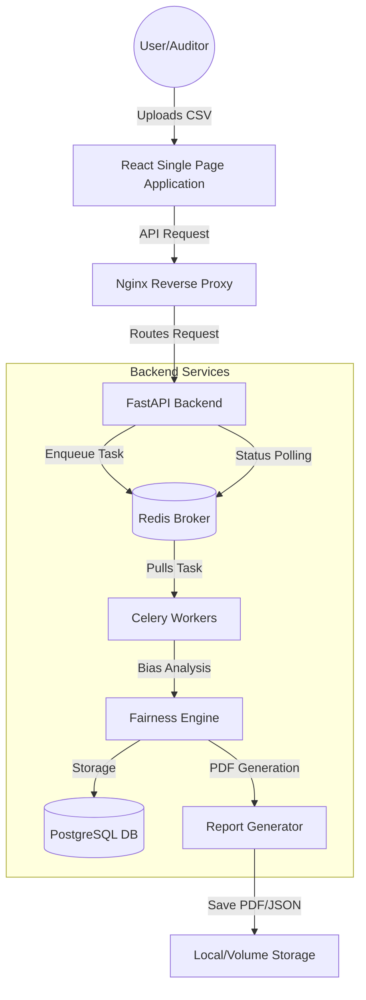

# 🚀 EquiLens AI — Enterprise Decision Auditor

> **Empowering Trust in AI through Automated Fairness Auditing, Bias Detection, and Transparent Reporting.**

[](https://www.docker.com/)
[](https://fastapi.tiangolo.com/)
[](https://reactjs.org/)

---

🌐 Live Demo

🔗 http://40.192.120.41

Deployed on AWS ECS (Fargate) with containerized frontend & backend.

---

## 🧠 Project Overview

**EquiLens AI** is a state-of-the-art full-stack platform designed to identify, quantify, and mitigate algorithmic bias in machine learning systems. By providing a multi-layered audit approach (Data + Model), it ensures that AI-driven decisions are fair, accountable, and ethically sound.

### Core Objectives
* **Bias Detection:** Uncover hidden disparities across demographic groups.
* **Fairness Quantization:** Measure models against industry-standard fairness metrics.
* **Regulatory Compliance:** Generate audit trails and PDF reports for legal and ethical verification.
* **Actionable Insights:** Provide clear recommendations to technical teams for model refinement.

---

✨ Features

* Feature Status ✅
* Bias Detection ✅
* Fairness Metrics ✅
* PDF Reports ✅
* REST API ✅
* Dockerized ✅
* AWS Deployment ✅

🧠 Key Highlights

* 📊 Multi-layer auditing (Data + Model)
* ⚖️ Industry-standard fairness metrics
* 📄 Automated compliance-ready reports
* ⚡ Production-ready architecture
* ☁️ Deployed on AWS ECS

---

## 🏗️ System Architecture

EquiLens AI follows a modern microservices-inspired architecture designed for scalability and asynchronous processing.

### High-Level Component Flow


---

## 🔄 End-to-End Pipeline & Workflow

The system operates on an automated pipeline that transforms raw data into comprehensive fairness reports.

### 1. Ingestion Phase
* **Endpoint:** `POST /api/v1/audit/run`
* **Process:** The system accepts multipart form data including a CSV dataset and metadata (target column, sensitive attributes).
* **Validation:** Schema validation ensures the presence of required columns and consistent label types.

### 2. The Fairness Engine (Core Logic)
The engine executes a battery of statistical tests:
* **Representation Bias:** Checks for subgroup under-representation.
* **Independence Check:** Evaluates **Demographic Parity** and **Disparate Impact**.
* **Separation Check:** Measures **Equal Opportunity** (TPR Gap) and **Error Rate Parity** (FPR/FNR Gaps).
* **Missingness Bias:** Detects if data is missing disproportionately for protected groups.

### 3. Asynchronous Execution
* Long-running audits are offloaded to **Celery workers** to ensure the API remains responsive.
* Progress is tracked via a task ID stored in Redis.

### 4. Reporting & Synthesis
* Findings are synthesized into an **Overall Risk Score (0 to 1)**.
* A human-readable **PDF Report** is generated using `ReportLab`, featuring executive summaries and deployment recommendations.
* A machine-readable **JSON JSON** is stored for downstream integration.

---

## 📊 Dataset Requirements & Conditions

To ensure accurate auditing, datasets must adhere to the following specifications:

| Requirement | Specification |
| :--- | :--- |
| **File Format** | Standard CSV (Comma Separated) |
| **Encoding** | UTF-8 |
| **Columns** | Must include a **Target** (Ground Truth) and one or more **Sensitive** columns. |
| **Labels** | Binary classification labels (e.g., 0/1, Yes/No, Approved/Denied). |
| **Missing Values** | Handled by the engine, but extreme missingness (>20%) triggers warnings. |
| **Sample Size** | Subgroups should ideally have >30 samples for statistically significant results. |

---

## 🛠️ ML Tools & Frameworks

The auditing core leverages industry-standard Python libraries:

* **Engine:** `Pandas` & `NumPy` for vectorized bias calculations.
* **Modeling:** Support for `Scikit-learn` (.joblib/pickle) and `ONNX` runtime models.
* **Audit Logic:** Custom implementation inspired by **Fairlearn** and **AIF360** methodologies.
* **PDF Engine:** `ReportLab` for dynamic PDF document synthesis.
* **Task Queue:** `Celery` + `Redis` for distributed task execution.

---

## 🚀 Environment Setup & Installation

### 🐳 Option 1: Docker (Recommended)
The fastest way to get EquiLens AI running is using Docker Compose.

1. **Clone the repository:**
   ```bash
   git clone https://github.com/Koreayush/Equilense_AI.git
   cd Equilense_AI
   ```

2. **Launch with Docker:**
   ```bash
   docker-compose up --build
   ```

3. **Access the platform:**
   * **Frontend:** `http://localhost:80`
   * **API Docs:** `http://localhost:8000/docs`

### 🔧 Option 2: Local Manual Setup (Development)

#### Backend Requirements
* Python 3.10+
* PostgreSQL & Redis running locally.

```bash
cd unbiased-ai/backend
python -m venv venv
source venv/bin/activate  # Or venv\Scripts\activate on Windows
pip install -r requirements.txt
uvicorn app.main:app --reload
```

#### Frontend Requirements
* Node.js 18+

```bash
cd unbiased-ai/frontend
npm install
npm run dev
```

---

## 📄 License

This project is licensed under the Apache-2.0 License - see the [LICENSE](LICENSE) file for details.

---

## 👨‍💻 Developed By

**Ayush Kore** & The EquiLens AI Team.
Built for real-world impact in the field of Responsible AI.

> “Don’t just build AI models. Build **fair** AI models.”
